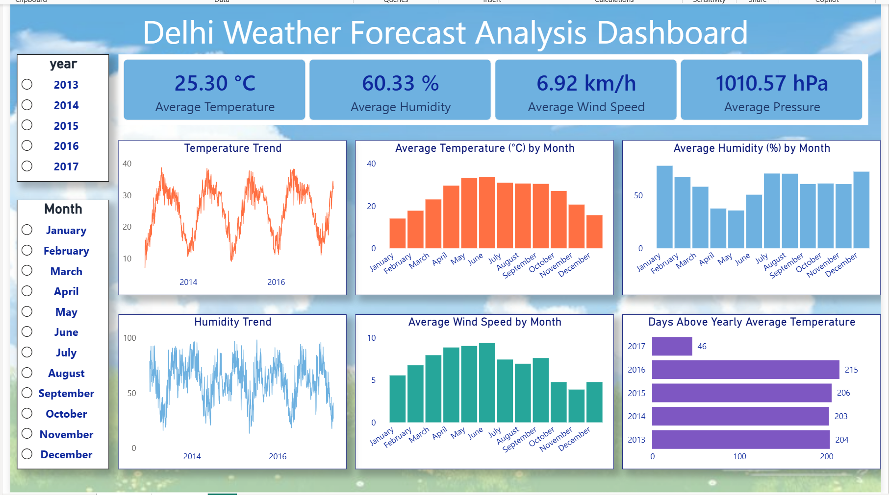
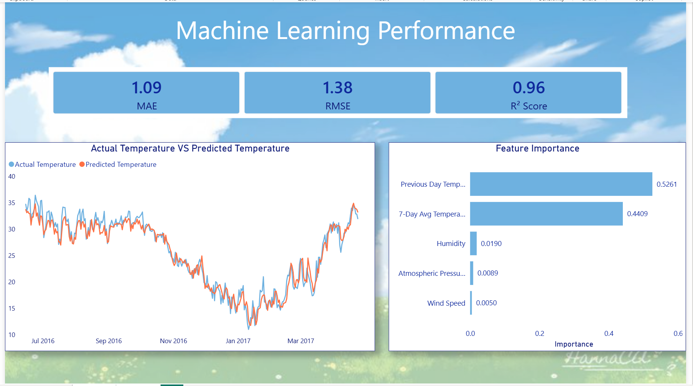

# 🌦️ Delhi Weather Analysis & Forecasting

An end-to-end weather analytics and machine learning project that analyzes historical climate data from Delhi to identify weather patterns and predict daily temperatures. The project integrates **Python, PostgreSQL, SQL, Power BI, and Scikit-learn** to demonstrate the complete data analytics workflow, from data preprocessing and exploratory analysis to machine learning, SQL-based insights, and interactive dashboard visualization.

## 📌 Project Overview

This project focuses on analyzing Delhi's daily climate data to uncover seasonal trends and build a predictive model for forecasting mean temperature.

The workflow includes:
- Data preprocessing and feature engineering using Python.
- Exploratory Data Analysis (EDA) to understand climate patterns.
- Training and evaluating a Random Forest Regression model.
- Performing SQL-based analytical queries using PostgreSQL.
- Building an interactive two-page Power BI dashboard for weather analytics and machine learning insights.

## 🎯 Objectives

- Analyze historical weather patterns in Delhi.
- Explore relationships among temperature, humidity, wind speed, and atmospheric pressure.
- Engineer time-based features to improve prediction accuracy.
- Build and evaluate a Random Forest Regression model.
- Perform advanced SQL analysis using PostgreSQL.
- Create interactive Power BI dashboards for analytical and predictive insights.

## 🛠️ Tech Stack

- **Programming:** Python
- **Libraries:** Pandas, NumPy, Matplotlib, Seaborn, Scikit-learn
- **Database:** PostgreSQL
- **Query Language:** SQL
- **Visualization:** Power BI
- **Development Environment:** Jupyter Notebook

## 📂 Project Structure

```text
Delhi-Weather-Forecast-Analysis/
│
├── data/
│   ├── DailyDelhiClimateTrain.csv
│   └── processed_weather_data.csv
│
├── notebooks/
│   └── Daily_Climate_Analysis.ipynb
│
├── sql/
│   └── Weather_SQL_Queries.sql
│
├── powerbi/
│   └── Delhi_Weather_Analysis_Dashboard.pbix
│
├── images/
│   ├── dashboard_page1.png
│   └── dashboard_page2.png
│
├── predictions.csv
├── feature_importance.csv
├── README.md
├── LICENSE
└── .gitignore
```

## 🔄 Project Workflow

1. Collected and cleaned historical Delhi weather data using Python.
2. Performed Exploratory Data Analysis (EDA) to identify weather trends and relationships.
3. Engineered time-based features such as lag values and rolling averages.
4. Trained a Random Forest Regression model to forecast daily mean temperature.
5. Evaluated model performance using MAE, RMSE, and R² Score.
6. Imported the processed dataset into PostgreSQL and performed SQL-based analysis.
7. Built an interactive two-page Power BI dashboard to visualize weather trends and machine learning insights.

## 📷 Dashboard Preview

### 📊 Page 1 – Weather Analytics Dashboard



---

### 🤖 Page 2 – Machine Learning Insights Dashboard



## 🤖 Machine Learning Model

The project uses a **Random Forest Regressor** to predict the daily mean temperature based on historical weather observations.

### Feature Engineering

- Previous Day Temperature (Lag Feature)
- 7-Day Rolling Average Temperature
- Humidity
- Wind Speed
- Atmospheric Pressure

### Model Evaluation Metrics

- **Mean Absolute Error (MAE)**
- **Root Mean Squared Error (RMSE)**
- **R² Score**

The model performance is visualized on the second page of the Power BI dashboard.

## 🗄 SQL Analysis

PostgreSQL was used to perform analytical queries on the processed weather dataset.

The SQL analysis includes:

- Monthly average temperature analysis
- Monthly average humidity analysis
- Monthly average wind speed analysis
- Monthly average atmospheric pressure analysis
- Top 10 hottest days
- Year-wise climate statistics
- Days above yearly average temperature using Common Table Expressions (CTEs)
- Ranking monthly temperatures using Window Functions

## 📈 Key Insights

- Temperature exhibits clear seasonal patterns across different months.
- Humidity and atmospheric pressure show noticeable variation throughout the year.
- Previous Day Temperature and the 7-Day Rolling Average significantly improve temperature prediction.
- SQL analysis provides additional insights into monthly and yearly climate trends.
- Interactive dashboards enable efficient exploration of historical weather patterns and machine learning results.

## 🚀 How to Run

1. Clone this repository.

```bash
git clone https://github.com/<anjalikumari6246>/Delhi-Weather-Forecast-Analysis.git
```

2. Install the required Python libraries:

```bash
pip install pandas numpy matplotlib seaborn scikit-learn jupyter
```

3. Open the Jupyter Notebook located in the `notebooks` folder.

4. Execute the notebook to perform data preprocessing, exploratory analysis, feature engineering, model training, and evaluation.

5. Import the processed dataset into PostgreSQL and execute the SQL queries available in the `sql` folder.

6. Open the Power BI dashboard (`.pbix`) from the `powerbi` folder to explore weather trends and machine learning insights.

## 🔮 Future Improvements

- Train and compare additional machine learning models such as XGBoost and LSTM.
- Incorporate weather data from multiple cities for comparative analysis.
- Build a real-time weather forecasting pipeline using live weather APIs.
- Deploy the trained model as a web application using Streamlit or Flask.

## 👩‍💻 Author

**Anjali Kumari**

GitHub: https://github.com/anjalikumari6246
